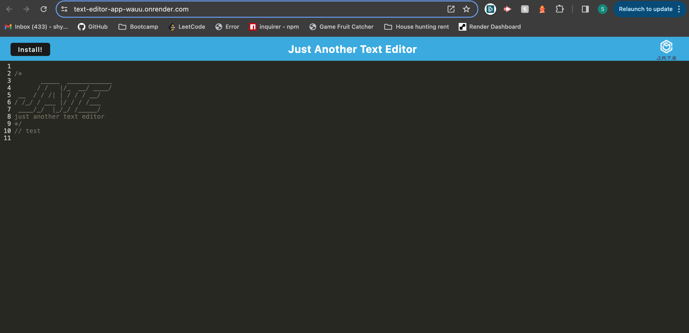
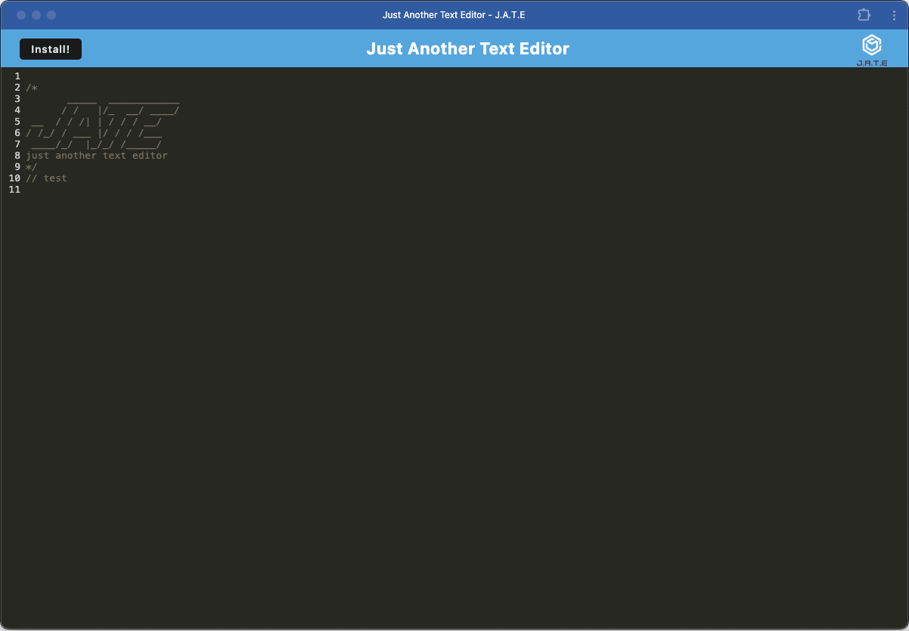

# J.A.T.E Application

## Description

J.A.T.E (Just another text editor) is a text editor that can run in the browser online or offline, and can be installed to your desktop

## Screenshots of the application

**Browser**

**Installed Application**

## Credits

The underlying technologies used in this text editor application are Express JS, and indexedDB, Workbox PWA, and CodeMirror themes, please find the documentations below:

- [Express JS](https://expressjs.com/)
- [IndexedDB](https://developer.mozilla.org/en-US/docs/Web/API/IndexedDB_API/Using_IndexedDB)
- [Workbox PWA](https://developer.chrome.com/docs/workbox)
- [Code Mirror themes](https://www.npmjs.com/package/code-mirror-themes)

## Link to Deployed Application

- [Render deployed application](https://text-editor-app-wauu.onrender.com/)
